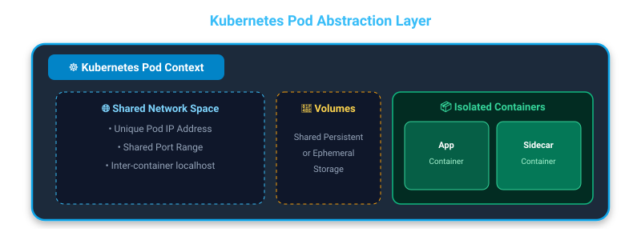
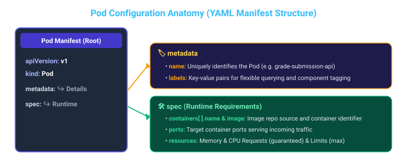
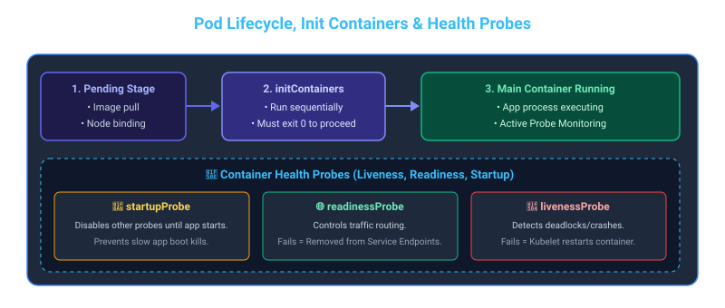

# ☸️ Section 1: Kubernetes Fundamentals, Pods & Architecture

---

## 📌 1. Key Takeaways & Kubernetes Architecture

**Kubernetes (K8s)** is an open-source container orchestration platform designed to automate the deployment, scaling, and management of containerized applications across a cluster of machines.

### 🏗️ Master Node (Control Plane) vs. Worker Nodes

- **Master Nodes (Control Plane):** Responsible for global cluster management, scheduling workloads, monitoring health, and making decisions about where applications run (components include `kube-apiserver`, `etcd`, `kube-scheduler`, and `kube-controller-manager`).
- **Worker Nodes:** Provide the infrastructure (compute, storage, and networking) to actually run the applications (components include `kubelet`, `kube-proxy`, and the container runtime).
- **Single-Node Cluster:** In local development environments (e.g., Minikube, Kind, Docker Desktop), your computer plays the dual role of **both Master and Worker Node**.


---

## 🐳 2. Containers vs. Pods

### 📦 Containers
Containers run applications in isolation with their dependencies, making them lightweight and highly portable across different runtime environments.

### ☸️ Pods
In Kubernetes, **Pods** are the smallest deployable units and encapsulate application containers. A Pod provides a shared execution context (IP address, storage volumes, and network namespace) for one or more containers.



---

## ⚙️ 3. Pod Configuration Anatomy & Resource Management

Pod configurations are declared using YAML files structured with key top-level sections: `metadata` and `spec`.

### 🏷️ Metadata
- **`name`**: Uniquely identifies the Pod within the cluster/namespace.
- **`labels`**: Key-value pairs used to categorize Pods into distinct groups for flexible querying and selection.

### 🛠️ Runtime Requirements (specified under `spec`)
- **Container name**: Identifier for individual containers inside the Pod.
- **Image source**: The registry repository and image tag (e.g., `rslim087/kubernetes-course-grade-submission-api:stateless`).
- **Port**: Exposed port for serving application requests (`containerPort`).
- **Resource requirements**: CPU and Memory allocations (**requests** & **limits**).



### 🎯 Best Practices for CPU & Memory Resources

| Resource | Request (Guaranteed) | Limit (Maximum Ceiling) | Kubernetes Best Practice |
| :--- | :--- | :--- | :--- |
| **Memory (`memory`)** | Minimum memory allocated for scheduling | Maximum memory allowed before OOM kill | **Memory limit and request should be the same.** This prevents node memory overcommitment and guarantees predictable Pod performance. |
| **CPU (`cpu`)** | Reserved CPU capacity | Hard throttling limit | **CPU limit should rarely be set.** Setting CPU limits can trigger CPU throttling even when host CPU is idle. |

#### 📄 Example YAML Manifest (`grade-submission-api-pod.yaml`):
```yaml
apiVersion: v1
kind: Pod
metadata:
  name: grade-submission-api
  labels:
    app.kubernetes.io/name: grade-submission
    app.kubernetes.io/component: backend
    app.kubernetes.io/instance: grade-submission-api
spec:
  containers:
  - name: grade-submission-api
    image: rslim087/kubernetes-course-grade-submission-api:stateless
    resources:
      requests:  
        memory: "128Mi"
        cpu: "128m"
      limits:
        memory: "128Mi" # Limit matches request; CPU limit omitted per best practice
    ports:
      - containerPort: 3000
  - name: grade-submission-api-health-checker
    image: rslim087/kubernetes-course-grade-submission-api-health-checker
    resources:
      requests:  
        memory: "128Mi"
        cpu: "200m"
      limits:
        memory: "128Mi"
```

---

## 🤝 4. Multi-Container Pods & Sidecar Pattern

Pods can run **multiple containers**, enabling helper patterns such as the **Sidecar Pattern**.

- Auxiliary **sidecar containers** run alongside the main application container to support tasks like health checking, log aggregation, or proxying.
- Containers inside the same Pod share the same network namespace and IP address.
- Communication between the main container and sidecar container occurs directly via **`localhost`**.


---

## 🔌 5. Port Forwarding in Kubernetes

**Port Forwarding** creates a temporary connection between your local workstation machine and a Pod running inside the cluster.

### 🎯 Primary Use Cases
- Primarily used for **debugging and testing** purposes to access private Pod ports locally without configuring external Services or Ingress controllers.

### 💻 Command Syntax
```bash
kubectl port-forward <pod-name> <local-port>:<pod-port>
```

#### Example 1: Forwarding local port 8080 to pod port 80
```bash
kubectl port-forward mypod 8080:80
```

#### Example 2: Forwarding local port 3000 to the grade submission API pod
```bash
kubectl port-forward grade-submission-api 3000:3000
```


---

## 🚀 6. Essential DevOps Concepts (Pods & Containers Scope)

From a production DevOps perspective, understanding the following core Pod & Container concepts is critical for reliability, security, and observability.



---

### 🔄 A. Init Containers (`initContainers`)

**Init Containers** are specialized containers that run **to completion before** the main application containers start.

- **Sequential Execution**: Run one at a time in the order specified in YAML.
- **Strict Pre-condition**: If an init container fails (returns non-zero status code), Kubernetes restarts the Pod until it succeeds (unless `restartPolicy: Never`).

#### Common DevOps Use Cases:
1. Running database schema migrations before starting web servers.
2. Waiting for dependent microservices or databases to become reachable (`nc -z -w 2 database-service 5432`).
3. Pre-fetching TLS certificates, configuration files, or secrets.

```yaml
spec:
  initContainers:
  - name: init-db-wait
    image: busybox:1.36
    command: ['sh', '-c', 'until nc -z -w 2 postgres-service 5432; do echo waiting for db; sleep 2; done;']
  containers:
  - name: grade-submission-api
    image: rslim087/kubernetes-course-grade-submission-api:stateless
```

---

### 🩺 B. Health Probes (Liveness, Readiness & Startup)

Kubernetes uses **Probes** to monitor container health and take automated corrective action.

#### The 3 Types of Probes:

| Probe Type | Purpose | Action on Failure |
| :--- | :--- | :--- |
| **`startupProbe`** | Checks if the application inside the container has completed its initial boot sequence. | Disables all other probes until it succeeds. Prevents slow-starting apps from being prematurely killed. |
| **`readinessProbe`** | Determines if the container is ready to accept user network traffic. | Removes Pod IP address from Service load balancing endpoints (avoids 502/503 HTTP errors). |
| **`livenessProbe`** | Detects deadlocks, infinite loops, or unrecoverable application crashes. | `kubelet` terminates and restarts the container based on `restartPolicy`. |

#### Probe Mechanisms:
- **`httpGet`**: Performs HTTP GET request on a specified path and port (Success if `200 <= status < 400`).
- **`exec`**: Runs a command inside the container (Success if exit code is `0`).
- **`tcpSocket`**: Checks if a TCP port is open.

```yaml
spec:
  containers:
  - name: grade-submission-api
    image: rslim087/kubernetes-course-grade-submission-api:stateless
    ports:
    - containerPort: 3000
    livenessProbe:
      httpGet:
        path: /healthz
        port: 3000
      initialDelaySeconds: 15
      periodSeconds: 10
    readinessProbe:
      httpGet:
        path: /ready
        port: 3000
      initialDelaySeconds: 5
      periodSeconds: 5
```

---

### 🔒 C. Pod Security Context (`securityContext`)

In production environments, running containers as `root` (UID 0) poses major security vulnerabilities. **SecurityContext** defines privilege and access control settings for Pods and containers.

#### DevOps Security Hardening Checklist:
- **`runAsNonRoot: true`**: Rejects execution if container image runs as root user.
- **`runAsUser` & `runAsGroup`**: Enforces specific non-privileged UID/GID (e.g., `10001`).
- **`readOnlyRootFilesystem: true`**: Mounts root filesystem as read-only to prevent unauthorized file writes/malware injection.
- **`allowPrivilegeEscalation: false`**: Prevents child processes from gaining more privileges than parent.
- **`capabilities.drop: ["ALL"]`**: Drops unnecessary Linux kernel privileges (e.g. `CAP_NET_RAW`, `CAP_SYS_ADMIN`).

```yaml
spec:
  securityContext:
    runAsNonRoot: true
    runAsUser: 10001
    runAsGroup: 10001
    fsGroup: 10001
  containers:
  - name: grade-submission-api
    image: rslim087/kubernetes-course-grade-submission-api:stateless
    securityContext:
      allowPrivilegeEscalation: false
      readOnlyRootFilesystem: true
      capabilities:
        drop:
        - ALL
```

---

### ⚡ D. Quality of Service (QoS) Classes

Kubernetes assigns a **Quality of Service (QoS) class** to each Pod based on its resource requests and limits. QoS classes dictate node eviction priority when a host node runs low on RAM/CPU resources.

| QoS Class | Condition | Node Pressure Eviction Priority |
| :--- | :--- | :--- |
| 🥇 **Guaranteed** | Every container in the Pod has **`memory` and `cpu` requests equal to limits**. | **Lowest Priority (Safest)** — Evicted last under extreme node resource starvation. |
| 🥈 **Burstable** | At least one container has requests specified, but requests $\neq$ limits or limits omitted. | **Medium Priority** — Evicted when Guaranteed Pods need reserved capacity. |
| 🥉 **BestEffort** | No requests or limits are set on any container. | **Highest Priority (First to die)** — Evicted immediately when node experiences memory pressure. |

> 💡 **DevOps Rule of Thumb:** Production workloads should always strive for **Guaranteed QoS** or carefully tuned **Burstable QoS**. Avoid `BestEffort` in production!

---

### 🔄 E. Pod Lifecycle, Restart Policies & Debugging States

#### 1. Pod `restartPolicy` Options:
- **`Always`** (Default): Kubelet automatically restarts the container whenever it terminates (standard for Deployments).
- **`OnFailure`**: Container is restarted only if it exits with a non-zero exit code (standard for batch Jobs).
- **`Never`**: Container is never restarted upon termination.

#### 2. Common DevOps Debugging States:
- **`ImagePullBackOff` / `ErrImagePull`**: Kubernetes cannot download the container image (wrong image name, non-existent tag, or missing image pull secret).
- **`CrashLoopBackOff`**: Container starts, fails/crashes, restarts, and crashes again in a loop. Kubernetes applies exponential backoff delays.
- **`OOMKilled` (Exit Code 137)**: Container process attempted to consume more RAM than its memory limit allowed and was killed by Linux OOM killer.
- **`Terminating`**: Pod is undergoing graceful shutdown.

---

### 🛑 F. Graceful Shutdown & Lifecycle Hooks

When a Pod is deleted, Kubernetes executes a **graceful shutdown sequence**:

1. **Service Removal**: Pod IP is removed from Endpoints so no new traffic is sent.
2. **`preStop` Hook Execution**: Optional hook (e.g., executing a command or HTTP request to finish active jobs or close DB connections).
3. **`SIGTERM` Signal**: Kubelet sends `SIGTERM` (signal 15) to main process PID 1 to initiate app clean exit.
4. **Grace Period Countdown**: Waits up to `terminationGracePeriodSeconds` (default: 30s).
5. **`SIGKILL` Signal**: If app fails to stop after grace period, Kubelet sends `SIGKILL` (signal 9) for immediate process kill.

```yaml
spec:
  terminationGracePeriodSeconds: 60
  containers:
  - name: grade-submission-api
    image: rslim087/kubernetes-course-grade-submission-api:stateless
    lifecycle:
      preStop:
        exec:
          command: ["/bin/sh", "-c", "sleep 10"] # Gives LB time to update routing
```
