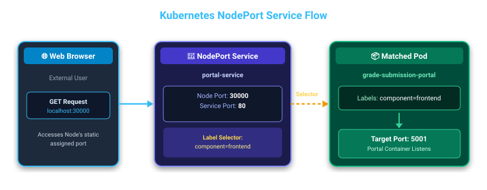
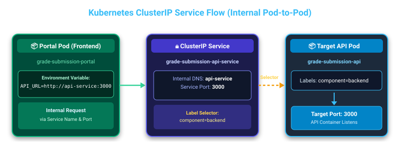

# 🌐 Kubernetes Service Discovery: NodePort & ClusterIP

---

## 📌 Introduction to Service Discovery

In Kubernetes, **Pods are ephemeral**—they are created, destroyed, and rescheduled dynamically. Whenever a Pod is recreated, it receives a new, unpredictable internal IP address. Directly connecting to Pod IP addresses is therefore highly unreliable.

To solve this, Kubernetes provides **Services**. A Service acts as a stable networking abstraction and load balancer in front of a set of Pods. It routes traffic dynamically to any healthy Pod matching its **label selector**.

---

## 🚪 1. NodePort Service (External Access for Prototyping)

### 💡 Concept & How it Works
A **NodePort Service** exposes an application to external traffic outside the cluster.

- **Ephemeral Pod IPs**: Pod IP addresses change frequently when Pods restart. Directly accessing a Pod by its IP is brittle and unmaintainable.
- **Static Node Port Assignment**: A NodePort service allocates a static port directly on every Node in the cluster, typically in the range **`30000` to `32767`** (or `30000-32000`).
- **Traffic Routing**: When external traffic arrives at `localhost:<node-port>` (or `<node-ip>:<node-port>`), the NodePort service intercept this traffic, evaluates its **label selector** to find matching Pods, and forwards the request to the matching Pod's **`targetPort`**.

> ⚠️ **DevOps / Production Warning**: NodePort is intended **strictly for local prototyping and development** (e.g., Minikube, Docker Desktop). It is **not used in production** due to severe security risks (exposing high ports publicly) and scaling limitations (port collision and lack of advanced load balancing). In production, **LoadBalancer** or **Ingress** controllers are used instead.

### 🖼️ NodePort Service Flow Diagram



---

## 🔒 2. ClusterIP Service (Internal Pod-to-Pod Communication)

### 💡 Concept & How it Works
A **ClusterIP Service** is the default Kubernetes service type and is used exclusively for **internal pod-to-pod communication** inside the cluster network.

- **Internal Cluster IP & DNS**: Kubernetes assigns a stable, internal-only Virtual IP address (ClusterIP) to the Service, which also resolves automatically via internal Cluster DNS using the **Service Name** (e.g., `grade-submission-api-service`).
- **Request Flow**: A calling Pod (such as a frontend web portal) reaches the target application (such as a backend REST API) by issuing a request directly to the **Service Name** and **Service Port**. The ClusterIP service receives the request, queries its label selector, and load-balances the traffic to the destination Pod's **`targetPort`**.
- **Environment Variable Configuration**: The calling application is typically configured with an environment variable pointing directly to the service name (e.g., `API_URL=http://grade-submission-api-service:3000`). From the calling application's perspective, this abstracted DNS setup feels like a **direct connection**.

### 🖼️ ClusterIP Service Flow Diagram



---

## 📄 3. Manifest Architecture & YAML Files

Below are the two corresponding service manifests created for our application:

### 1. NodePort Service Manifest (`grade-submission-portal-service.yaml`)
Exposes the frontend portal on static node port `30000`, forwarding to `targetPort: 5001`.

```yaml
apiVersion: v1
kind: Service
metadata:
  name: grade-submission-portal-service
spec:
  type: NodePort
  selector:
    app.kubernetes.io/component: frontend
    app.kubernetes.io/instance: grade-submission-portal
  ports:
    - port: 80
      targetPort: 5001
      nodePort: 30000
```

### 2. ClusterIP Service Manifest (`grade-submission-api-service.yaml`)
Exposes the backend API internally within the cluster on port `3000`, matching Pods labeled `component: backend`.

```yaml
apiVersion: v1
kind: Service
metadata:
  name: grade-submission-api-service
spec:
  type: ClusterIP
  selector:
    app.kubernetes.io/component: backend
    app.kubernetes.io/instance: grade-submission-api
  ports:
    - port: 3000
      targetPort: 3000
```

---

## 🛠️ 4. Commands to Run, Observe & Verify Service Discovery

Use the following `kubectl` commands to deploy the Pods and Services, inspect how label selectors bind Endpoints, and test internal/external connectivity.

### 🚀 Step 1: Deploy Pods and Services

Apply all manifests in the `ServiceDiscovery` folder:

```bash
# Apply all Pods and Services in the directory
kubectl apply -f .

# Alternatively, apply manifests individually:
kubectl apply -f grade-submission-api-pod.yaml
kubectl apply -f grade-submission-portal-pod.yaml
kubectl apply -f grade-submission-api-service.yaml
kubectl apply -f grade-submission-portal-service.yaml
```

---

### 🔍 Step 2: Observe Active Resources & Service Bindings

#### A. List all running Pods (with IP address details):
```bash
kubectl get pods -o wide
```
*Expected Output*: Displays Pod status, individual assigned Pod IP addresses (e.g., `10.244.0.5`), and host node assignment.

#### B. List all active Services:
```bash
kubectl get services
# OR
kubectl get svc
```
*Expected Output*: Displays `grade-submission-api-service` with type `ClusterIP` on port `3000/TCP`, and `grade-submission-portal-service` with type `NodePort` mapping `80:30000/TCP`.

#### C. Inspect Service Endpoints (Label Selector Verification):
Kubernetes automatically populates **Endpoints** by matching Service label selectors to Pod labels.

```bash
# View all Endpoints mapped to Pod IPs
kubectl get endpoints
# OR
kubectl get ep

# Detailed view of ClusterIP Service Endpoints
kubectl describe svc grade-submission-api-service

# Detailed view of NodePort Service Endpoints
kubectl describe svc grade-submission-portal-service
```
*Key Observation*: Check the `Endpoints:` line in `kubectl describe`. It should show the exact IP address and target port of the target Pod. If `Endpoints: <none>`, the Service label selector does not match any running Pod's labels!

---

### 🧪 Step 3: Test and Verify Service Connectivity

#### A. Test NodePort Externally (Browser / Localhost):
Open your web browser or run `curl` to access the NodePort service from your workstation:

```bash
curl http://localhost:30000
```
*For Minikube users*:
```bash
minikube service grade-submission-portal-service --url
```

#### B. Test ClusterIP Internal Communication (Pod-to-Pod & DNS):
Verify internal DNS resolution and service discovery from inside the Portal Pod to the API ClusterIP Service:

```bash
# 1. Test HTTP connectivity using Service Name & Service Port
kubectl exec -it grade-submission-portal -- curl http://grade-submission-api-service:3000

# 2. Verify Cluster DNS resolution for the ClusterIP Service Name
kubectl exec -it grade-submission-portal -- nslookup grade-submission-api-service
```
*Key Observation*: `nslookup` returns the virtual ClusterIP assigned to `grade-submission-api-service`. The Portal Pod communicates seamlessly using the service hostname without ever knowing the underlying Pod's ephemeral IP!

---

### 🧹 Step 4: Cleanup Resources

Remove all created Pods and Services when testing is complete:

```bash
kubectl delete -f .
```
