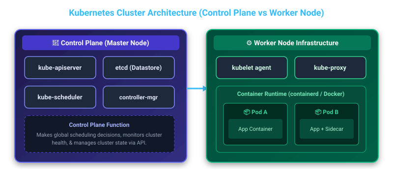
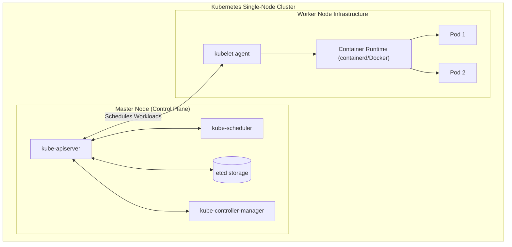
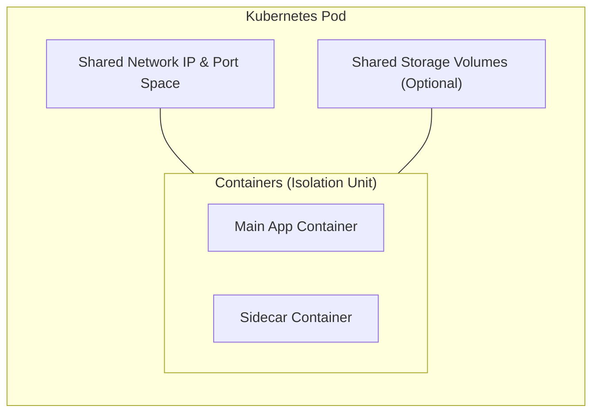
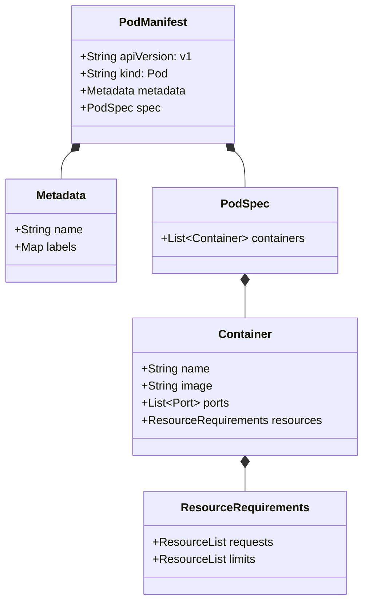
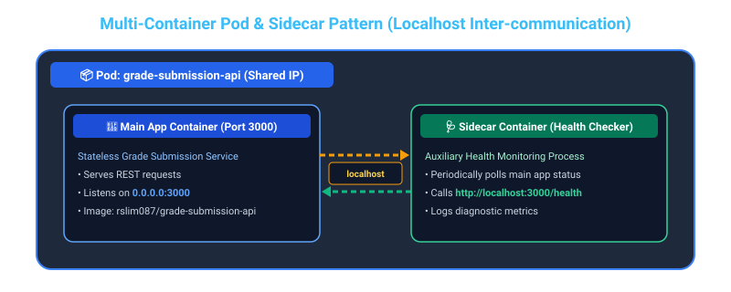
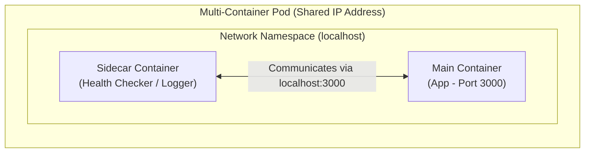
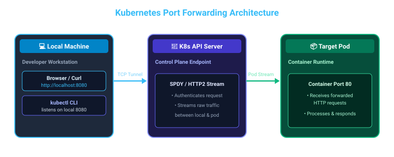
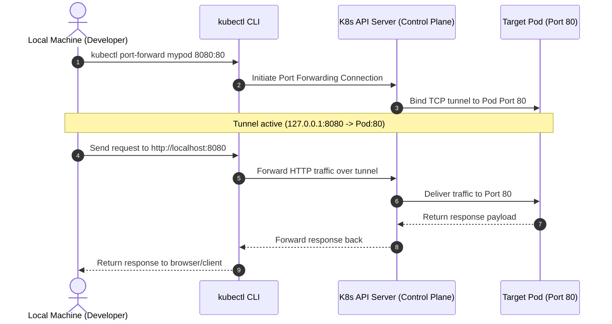

# ☸️ Section 1: Kubernetes Fundamentals, Pods & Architecture

---

## 📌 1. Key Takeaways & Kubernetes Architecture

**Kubernetes (K8s)** is an open-source container orchestration platform designed to automate the deployment, scaling, and management of containerized applications across a cluster of machines.

### 🏗️ Master Node (Control Plane) vs. Worker Nodes

- **Master Nodes (Control Plane):** Responsible for global cluster management, scheduling workloads, monitoring health, and making decisions about where applications run (components include `kube-apiserver`, `etcd`, `kube-scheduler`, and `kube-controller-manager`).
- **Worker Nodes:** Provide the infrastructure (compute, storage, and networking) to actually run the applications (components include `kubelet`, `kube-proxy`, and the container runtime).
- **Single-Node Cluster:** In local development environments (e.g., Minikube, Kind, Docker Desktop), your computer plays the dual role of **both Master and Worker Node**.



<details>
<summary><b>View Mermaid Source Code</b></summary>


</details>

---

## 🐳 2. Containers vs. Pods

### 📦 Containers
Containers run applications in isolation with their dependencies, making them lightweight and highly portable across different runtime environments.

### ☸️ Pods
In Kubernetes, **Pods** are the smallest deployable units and encapsulate application containers. A Pod provides a shared execution context (IP address, storage volumes, and network namespace) for one or more containers.


<details>
<summary><b>View Mermaid Source Code</b></summary>


</details>

---

## ⚙️ 3. Pod Configuration Anatomy

Pod configurations are declared using YAML files structured with key top-level sections: `metadata` and `spec`.

### 🏷️ Metadata
- **`name`**: Uniquely identifies the Pod within the cluster/namespace.
- **`labels`**: Key-value pairs used to categorize Pods into distinct groups for flexible querying and selection.

### 🛠️ Runtime Requirements (specified under `spec`)
- **Container name**: Identifier for individual containers inside the Pod.
- **Image source**: The registry repository and image tag (e.g., `rslim087/kubernetes-course-grade-submission-api:stateless`).
- **Port**: Exposed port for serving application requests (`containerPort`).
- **Resource requirements**: CPU and Memory allocations (**requests** & **limits**).


<details>
<summary><b>View Mermaid Source Code</b></summary>


</details>

### 🎯 Best Practices for CPU & Memory Resources

| Resource | Request (Guaranteed) | Limit (Maximum Ceiling) | Kubernetes Best Practice |
| :--- | :--- | :--- | :--- |
| **Memory (`memory`)** | Minimum memory allocated for scheduling | Maximum memory allowed before OOM kill | **Memory limit and request should be the same.** This prevents node memory overcommitment and guarantees predictable Pod performance. |
| **CPU (`cpu`)** | Reserved CPU capacity | Hard throttling limit | **CPU limit should rarely be set.** Setting CPU limits can trigger CPU throttling even when host CPU is idle. |

#### 📄 Example YAML Manifest (`grade-submission-api-pod.yaml`):
```yaml
apiVersion: v1
kind: Pod
metadata:
  name: grade-submission-api
  labels:
    app.kubernetes.io/name: grade-submission
    app.kubernetes.io/component: backend
    app.kubernetes.io/instance: grade-submission-api
spec:
  containers:
  - name: grade-submission-api
    image: rslim087/kubernetes-course-grade-submission-api:stateless
    resources:
      requests:  
        memory: "128Mi"
        cpu: "128m"
      limits:
        memory: "128Mi" # Limit matches request; CPU limit omitted per best practice
    ports:
      - containerPort: 3000
  - name: grade-submission-api-health-checker
    image: rslim087/kubernetes-course-grade-submission-api-health-checker
    resources:
      requests:  
        memory: "128Mi"
        cpu: "200m"
      limits:
        memory: "128Mi"
```

---

## 🤝 4. Multi-Container Pods & Sidecar Pattern

Pods can run **multiple containers**, enabling helper patterns such as the **Sidecar Pattern**.

- Auxiliary **sidecar containers** run alongside the main application container to support tasks like health checking, log aggregation, or proxying.
- Containers inside the same Pod share the same network namespace and IP address.
- Communication between the main container and sidecar container occurs directly via **`localhost`**.



<details>
<summary><b>View Mermaid Source Code</b></summary>


</details>

---

## 🔌 5. Port Forwarding in Kubernetes

**Port Forwarding** creates a temporary connection between your local workstation machine and a Pod running inside the cluster.

### 🎯 Primary Use Cases
- Primarily used for **debugging and testing** purposes to access private Pod ports locally without configuring external Services or Ingress controllers.

### 💻 Command Syntax
```bash
kubectl port-forward <pod-name> <local-port>:<pod-port>
```

#### Example 1: Forwarding local port 8080 to pod port 80
```bash
kubectl port-forward mypod 8080:80
```

#### Example 2: Forwarding local port 3000 to the grade submission API pod
```bash
kubectl port-forward grade-submission-api 3000:3000
```



<details>
<summary><b>View Mermaid Source Code</b></summary>


</details>
